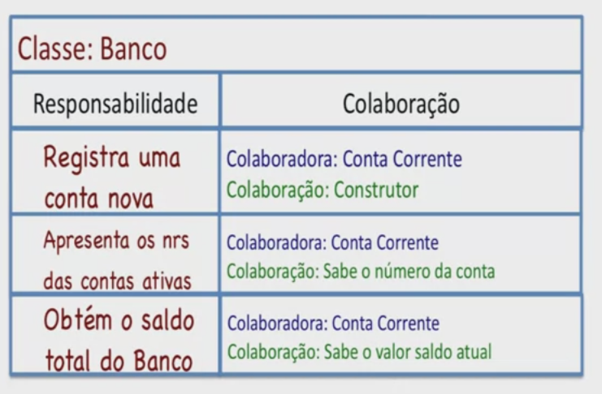
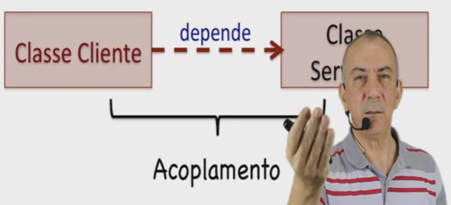

# Construtores de classes
É possível ter vários construtores **com tipos de parâmetros diferentes!**

````java
public class Carro {
    Carro(int potencia) {}
    Carro(String nome) {}
    Carro(int potencia, String nome) {}
}
````

# CRC (Classe, Responsabilidade e Colaboração)

## Identificando responsabilidades

Responsabilidade = constitui o que a classe sabe ou faz.

Pode-se usar o antropomorfismo, perguntando a entidade o que ela sabe (estado/atributos) e o que ela faz (comportamentos/métodos).

## Lógica das responsabilidades

Uma responsabilidade corresponde a "o quê" deve ser feito, a lógica da responsabilidade corresponde a "como" deve ser feito. Por exemplo, a lógica de uma responsabilidade do tipo faz corresponde ao conjunto de ações que a responsabilidade deve realizar.

## Identificando colaborações

- Classe colaboradora = classe **servidora** 
- Classe que depende da classe colaboradora = classe **cliente**


- Cartão CRC
  

- Acoplamento (buscar sempre diminuir tal aspecto)
  