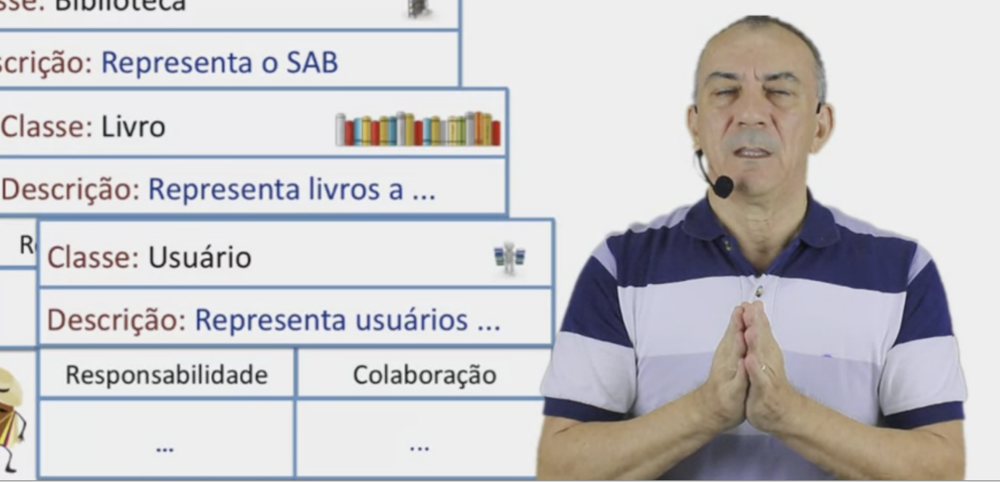
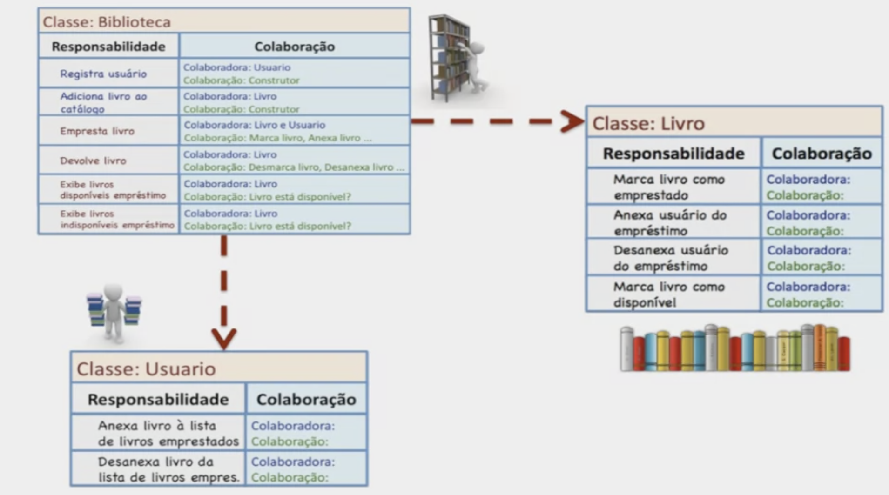

# Modelagem CRC

## Passo 0
Especificação da aplicação.

## Passo 1
Identificar os objetos e classes:
- procurar por substantivos/nomes na especificação -> potenciais objetos e classes

## Passo 2
Refinar a lista de classes:
- identificar nomes diferentes que representam a mesma classe
  - deixar no singular
- nomes fora do escopo do sistema e/ou são verbos "enrustidos"
- retirar nomes que representam atributos
- Identificar classes e subclasses
- remover atores que interagem com o sistema
- Descrever o que cada classe faz
  - adicionar no cartão CRC

## Passo 3
Responsabilidades óbvias.

- identificar responsabilidades óbvias de cada classe.
  - classe sabe -> atributos
  - classe faz -> métodos

## Passo 4
Identificar verbos (da especificação) como responsabilidades.

- listagem dos verbos encontrados

## Passo 5
Atribuição das novas responsabilidades.

- para cada potencial responsabilidade:
  - verifique a classe a ser atribuída:
    - se corresponder a responsabilidade óbvia, buscar outra classe
    - se não, busque uma classe para atribuir

## Passo 6
Lógica das responsabilidades, em especial do tipo faz.

- Descrever lógica
- Identificar novas responsabilidades
- Identificar colaborações

