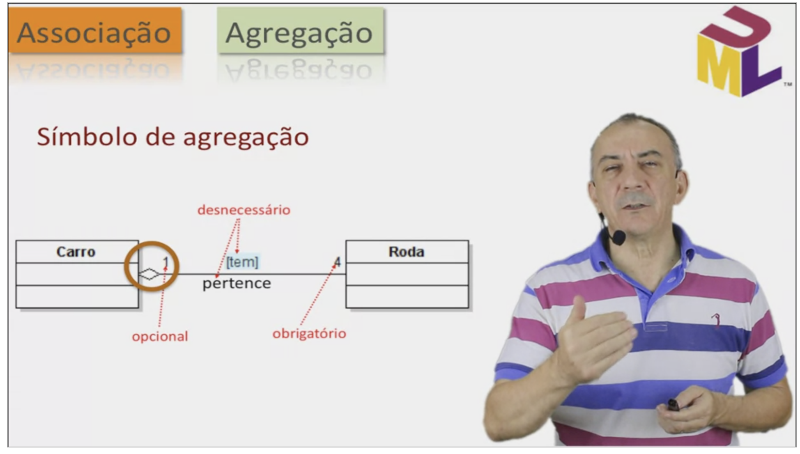
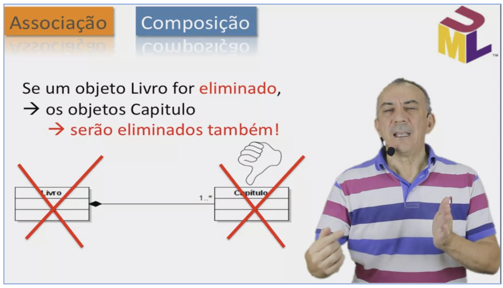
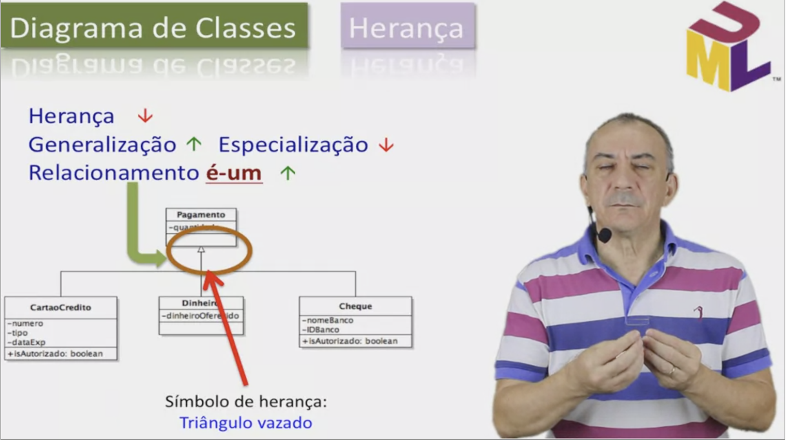
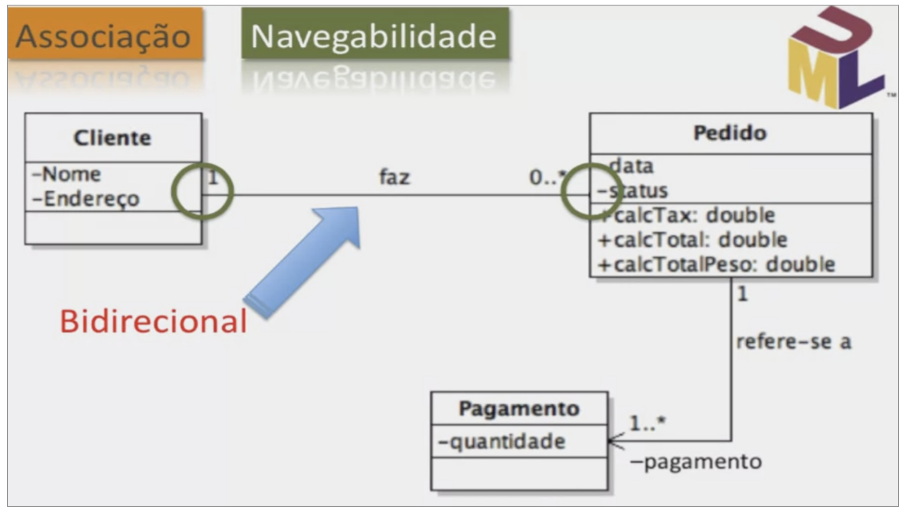

# Diagrama de Classes UML

## Visibilidade

## Relacionamentos

- Associação
  - Agregação
    - tem-um / é-parte-de
  
    - carro tem rodas
    - roda pertence a um carro
    - símbolo: diamante
    - se carro for removido, rodas continuam
  - Composição
    - tem-um / é-parte-de
    
    - símbolo: diamante negro
    - se livro for removido, capítulos devem ser removido
      - livro é que cria os capítulos
- Herança ou generalização
  
- Dependência

## Navegabilidade
