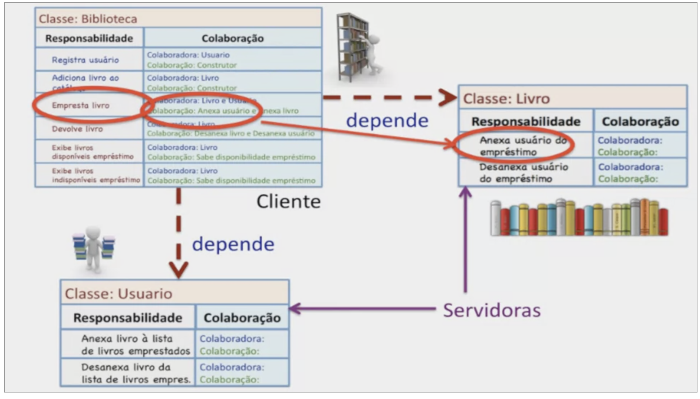

# Colaboração, Dependência e Contrato de Classes

## Dependência
- Se o objeto Biblioteca não pode existir sem o objeto Livro
    - então o objeto Biblioteca **depende** do objeto Livro
    - biblioteca (classe cliente) -> livro (classe servidora)

## Responsabilidade pública
- quando há colaboração de pelo menos uma responsabildade de classe cliente

## Responsabilidade privada
- é parte do funcionamento interno da classe
- não pode colaborar com instância de subclasse
  - ou seja, método privado não é herdado

## Contrato (protocolo/interface)
- conjunto de serviços/comportamentos de um objeto
- conjunto de responsabilidades públicas