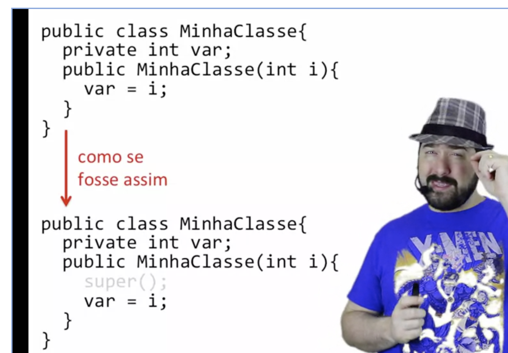

# Cadeia de construtores

- "super()" = chamada ao construtor da superclasse
- sempre a primeira chamada de um construtor deve ser uma chamada para o construtor da superclasse (implicitamente ou explicitamente).
  - caso o construtor exija parâmetros, faz-se necessário explicitar a chamada ao super(parametros)