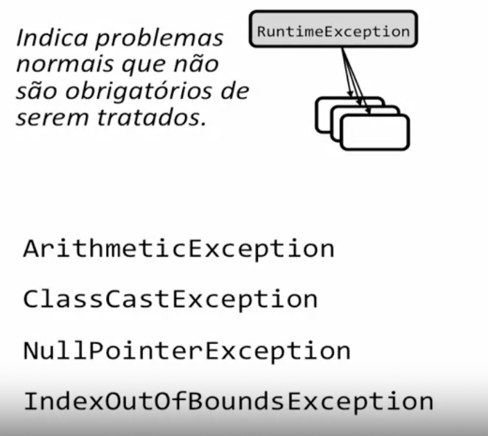

# Exceções em Java

```java
public class Teste {
    // declarar explicitamente as exceções que pode lançar
    public void metodo(int arg) throws MinhaExcecao {
        if (erro) {
            throw new MinhaExcecao();
        }
    }

    // ou, passar informação da exceção adiante
    public void metodo2(int arg) throws MinhaExcecao {
        metodo(arg);
    }
    
    // ou tratar internamente
    public void metodo3(int arg) {
        try {
            metodo();
        } catch (MinhaExecao e) {
            // log
        } finally {
            // sempre executado
            // ex: fechar conexão, arquivo
        }
    }
}
```



