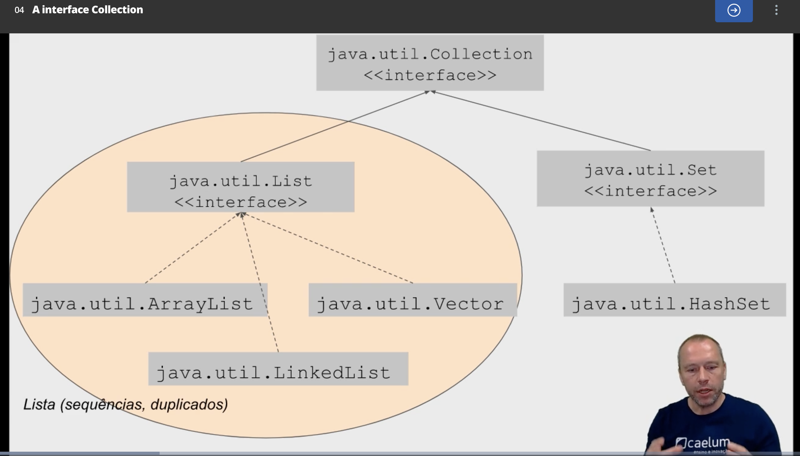
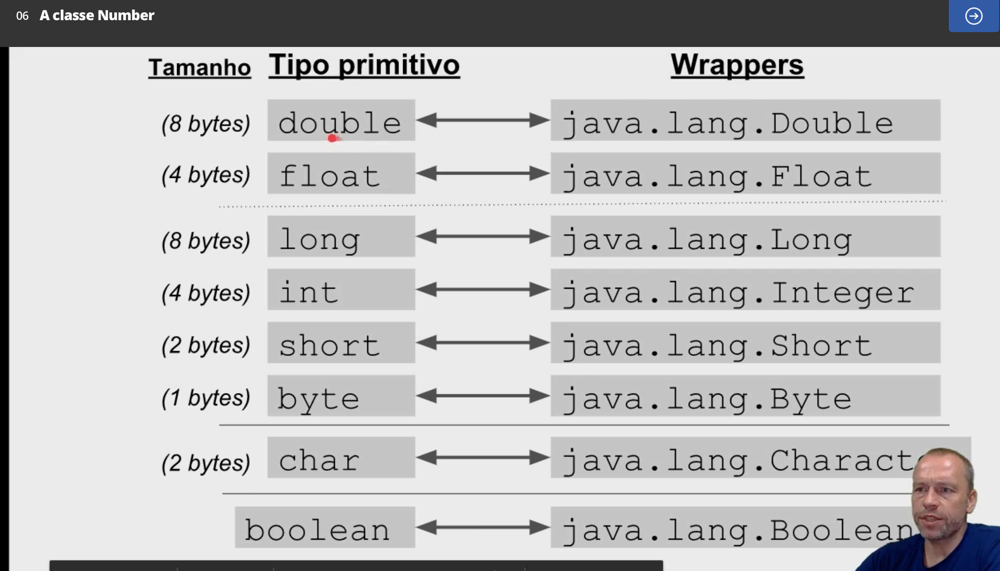
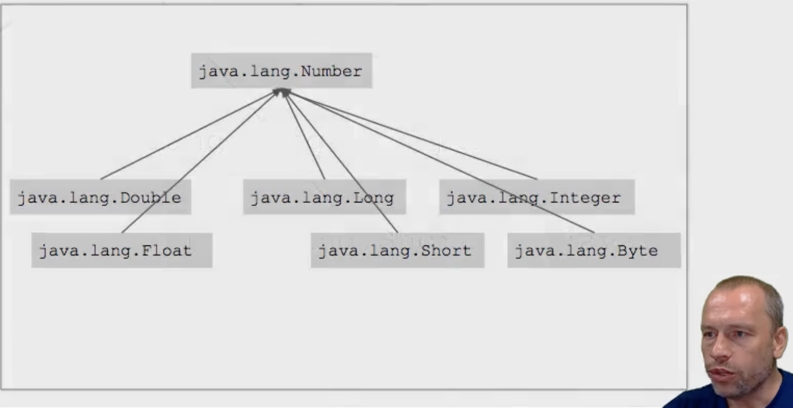

# Array
- an object
```java
// init an array of ints with 5 positions, each one with 0
int[] ages = new int[5];
int[] agesToo = {0, 0, 0, 0, 0}; // equivalent

// array of references
String[] names = new String[10];
Object[] references = new Object[10];

references[0] = "Teste";
references[1] = 22;
```

## Casting
### Implicit casting
```java
int number = 3;
double floatingNumber = number; // implicit cast
double floatingNumber2 = (double) number; // explicit cast
```

```java
import java.util.Arrays;

// array to list
String[] args;
List<String> argsList = Arrays.asList(args);
```

# Interface List
Interface that ArrayList, LinkedList and Vector implement.

# java.util.ArrayList
- array with steroids
- dynamic array
- ++ easy access by the index
- -- hard to add/remove elements before the end
```java
import java.util.ArrayList;

// array of objects
ArrayList list = new ArrayList();
list.add("Test");
list.add(22);
list.size(); // 2

// array of type T, using generics
ArrayList<T> listOfT = new ArrayList<T>();

// expliciting an initial capacity
ArrayList list = new ArrayList(26);

// creating a new arrayList based on another
ArrayList newList = new ArrayList(list);
```

# java.util.LinkedList
- sequence, double pointers
- ++ easy to add/remove elements before the end
- -- need traversal to find elements

# java.util.Vector
- threadsafe
  - can be operated safely by other threads

# Interface Collection
- works only with references (no primitives)
- 

# Autoboxing and unboxing
- Java automatically converts between primitives (f.i: int) to objects (f.i: java.lang.Integer) when needed.
- Autoboxing: primitive -> Wrapper
- Unboxing: Wrapper -> primitive

# java.lang.Integer
- int wrapper
```java
int age = 36;
Integer ageObject = Integer.valueOf(age);
int ageAgain = ageObject.intValue(); // unboxing

// parsing
int argPrimitive = Integer.parseInt(args[0]);
Integer argWrapper = Integer.valueOf(args[0]);
```

# Wrappers


# Number class
