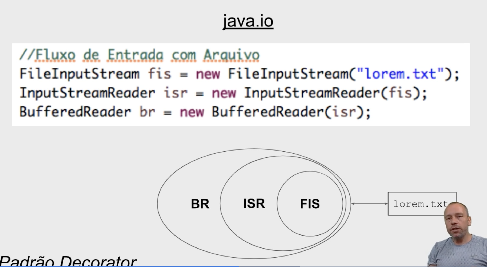

- 
- Input
  - InputStream ... input stream of bytes ...
  - InputStreamReader
  - Reader ... reading characters streams ...
  - System.in (entrada pelo terminal)
  - Socket (rede)
- Output
  - OutputStream
  - OutputStreamWriter
  - Writer

## Properties
java.util.Properties
- arquivo para configurações do projeto
```java
// Salvando properties
//import deve ser java.util.Properties
Properties props = new Properties(); 
props.setProperty("login", "alura"); //chave, valor
props.setProperty("senha", "alurapass");
props.setProperty("endereco", "www.alura.com.br");
props.store(new FileWriter("conf.properties"), "algum comentário");

# arquivo conf.properties
#algum comentário
#Thu May 10 14:29:38 BRT 2018
senha=alurapass
login=alura
endereco=www.alura.com.br

// Leitura de properties
Properties props = new Properties();
props.load(new FileReader("conf.properties"));

String login = props.getProperty("login");
String senha = props.getProperty("senha");
String endereco = props.getProperty("endereco");

System.out.println(login + ", " + senha  + ", " +  endereco);

```

## Character Sets
- caractere (é) -> Unicode codepoint (0233) -> (encoding, utf-8, iso, ascii) -> armazenamento

## Serialização/Desserialização
- atributo marcado como "transient" não será serializável
- É boa prática colocar o atributo estático serialVersionUID para versionar a classe;